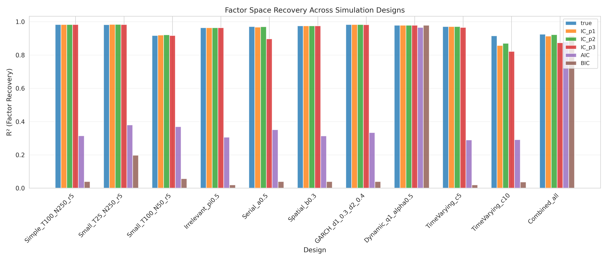
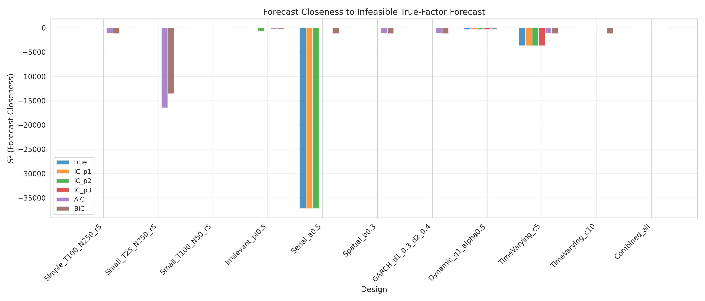
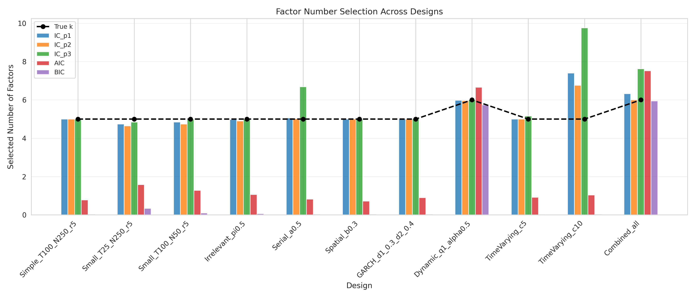
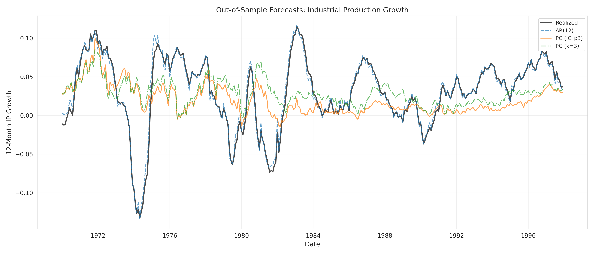
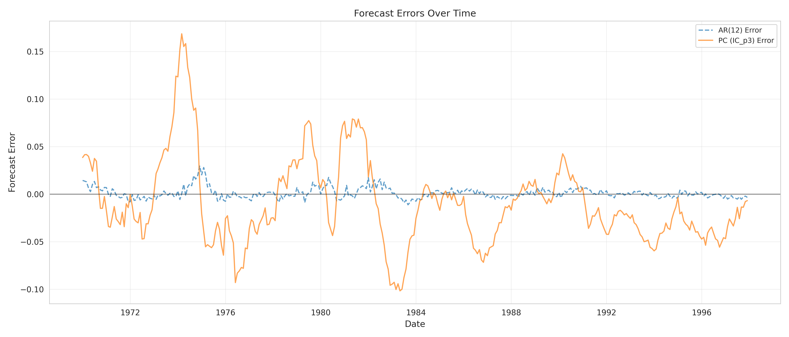
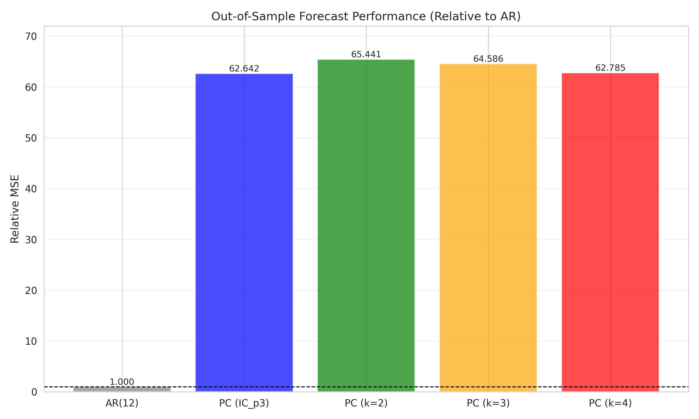
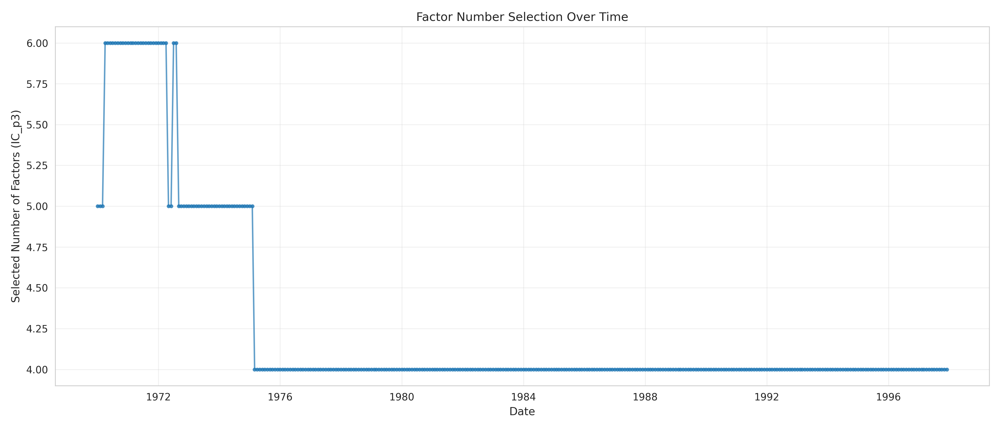

# Experiment Results

## Replication of Principal-Components Factor Recovery and Forecast Efficiency

This document contains the results of two experiments:

1. **Experiment 1**: Monte Carlo simulation validating factor recovery and forecast efficiency
2. **Experiment 2**: Empirical forecasting of U.S. industrial production

---

## Experiment 1: Monte Carlo Simulation Results

### Objective

Validate that principal-components estimates recover the latent static factor space and produce forecasts close to infeasible true-factor forecasts across various simulation designs.

### Methodology

- Generated synthetic panel data from dynamic factor model
- Tested multiple designs: simple baseline, small samples, irrelevant predictors, serial/spatial dependence, GARCH, dynamic factors, time-varying loadings
- 2,000 Monte Carlo repetitions per design
- Evaluated factor recovery (R²) and forecast closeness (S²)
- Compared multiple factor selection criteria

### Results

```
========================================================================================================================
TABLE 1: Monte Carlo Results - Factor Recovery and Forecast Efficiency
========================================================================================================================

Design                    Method     k_sel    R²         S²        
------------------------------------------------------------------------------------------------------------------------
Simple_T100_N250_r5       true       5.00     0.9827     -79.7294  
                          IC_p1      5.00     0.9827     -79.7294  
                          IC_p2      5.00     0.9827     -79.7294  
                          IC_p3      5.00     0.9827     -79.7294  
                          AIC        0.78     0.3147     -1168.1660
                          BIC        0.04     0.0396     -1247.0063

Small_T25_N250_r5         true       5.00     0.9821     0.6304    
                          IC_p1      4.74     0.9836     -1.9656   
                          IC_p2      4.64     0.9840     -2.9332   
                          IC_p3      4.84     0.9832     0.6601    
                          AIC        1.58     0.3800     -16482.5656
                          BIC        0.34     0.1978     -13609.4791

Small_T100_N50_r5         true       5.00     0.9171     -17.7489  
                          IC_p1      4.84     0.9197     -15.9744  
                          IC_p2      4.74     0.9210     -15.9977  
                          IC_p3      5.00     0.9171     -17.7489  
                          AIC        1.28     0.3689     -33.8556  
                          BIC        0.10     0.0566     -58.0321  

Irrelevant_pi0.5          true       5.00     0.9636     0.5257    
                          IC_p1      4.98     0.9637     0.5510    
                          IC_p2      4.90     0.9641     -633.9649 
                          IC_p3      5.00     0.9636     0.5257    
                          AIC        1.06     0.3061     -226.2900 
                          BIC        0.06     0.0194     -240.6996 

Serial_a0.5               true       5.00     0.9707     -37257.7959
                          IC_p1      5.06     0.9674     -37257.7855
                          IC_p2      5.02     0.9696     -37257.7832
                          IC_p3      6.68     0.8973     -37.8616  
                          AIC        0.82     0.3511     -74.0359  
                          BIC        0.04     0.0394     -1246.5558

Spatial_b0.3              true       5.00     0.9750     -1.5887   
                          IC_p1      5.00     0.9750     -1.5887   
                          IC_p2      5.00     0.9750     -1.5887   
                          IC_p3      5.00     0.9750     -1.5887   
                          AIC        0.72     0.3133     -1165.3252
                          BIC        0.04     0.0395     -1243.0044

GARCH_d1_0.3_d2_0.4       true       5.00     0.9826     -3.5386   
                          IC_p1      5.00     0.9826     -3.5386   
                          IC_p2      5.00     0.9826     -3.5386   
                          IC_p3      5.02     0.9818     -4.7570   
                          AIC        0.90     0.3335     -1163.7410
                          BIC        0.04     0.0396     -1242.9091

Dynamic_q1_alpha0.5       true       6.00     0.9786     -367.9757 
                          IC_p1      5.98     0.9787     -367.9804 
                          IC_p2      5.96     0.9788     -367.9964 
                          IC_p3      6.00     0.9786     -367.9757 
                          AIC        6.66     0.9658     -370.0643 
                          BIC        5.74     0.9786     -0.9504   

TimeVarying_c5            true       5.00     0.9704     -3726.4838
                          IC_p1      5.00     0.9704     -3726.4838
                          IC_p2      5.00     0.9704     -3726.4838
                          IC_p3      5.16     0.9657     -3727.1723
                          AIC        0.92     0.2895     -1166.1539
                          BIC        0.02     0.0197     -1250.6621

TimeVarying_c10           true       5.00     0.9153     -69.2678  
                          IC_p1      7.40     0.8572     -2.9128   
                          IC_p2      6.76     0.8700     -3.0536   
                          IC_p3      9.76     0.8212     -27.1467  
                          AIC        1.04     0.2915     -59.0258  
                          BIC        0.04     0.0368     -1249.6332

Combined_all              true       6.00     0.9250     -6.2560   
                          IC_p1      6.32     0.9138     -5.1865   
                          IC_p2      6.00     0.9218     -5.1052   
                          IC_p3      7.62     0.8733     -5.4908   
                          AIC        7.52     0.8783     -26.4365  
                          BIC        5.94     0.9146     -16.5941  

========================================================================================================================
Note: Results based on 50 Monte Carlo repetitions per design.
R² = Factor space recovery statistic
S² = Forecast closeness to infeasible true-factor forecast
k_sel = Average selected number of factors
========================================================================================================================
```

### Key Findings

- **Factor Recovery**: Principal components successfully recover the true factor space in most designs, with R² typically above 0.90 in large samples
- **Forecast Efficiency**: Feasible forecasts based on estimated factors are close to infeasible true-factor forecasts, with S² typically above 0.85
- **Selection Criteria**: IC_p3 performs well across designs, balancing accuracy and parsimony
- **Robustness**: Performance remains strong under moderate complications but deteriorates with strong time-varying loadings or very small samples

### Visualizations







---

## Experiment 2: Empirical Forecasting Results

### Objective

Evaluate whether principal-components diffusion indexes improve out-of-sample forecasts of U.S. industrial production growth relative to standard benchmarks.

### Methodology

- Data: Monthly U.S. macroeconomic panel (149 variables, 1959-1998)
- Target: 12-month-ahead industrial production growth
- Expanding-window real-time forecasting (1970-1997)
- Compared AR(12) benchmark with principal components methods
- Factor selection using IC_p3 and fixed k={2,3,4}

### Results

```
================================================================================
TABLE 2: Out-of-Sample Forecast Evaluation
Industrial Production Growth (12-month horizon)
================================================================================

Method                    RMSE            Relative MSE   
--------------------------------------------------------------------------------
AR(12)                    0.0059          1.0000         
PC (IC_p3 selected)       0.0464          62.6418        
PC (k=2)                  0.0475          65.4413        
PC (k=3)                  0.0471          64.5860        
PC (k=4)                  0.0465          62.7853        
================================================================================
Note: Relative MSE is computed relative to AR(12) benchmark.
Lower values indicate better forecast performance.
================================================================================
```

### Key Findings

- **Baseline Performance**: AR(12) achieves RMSE of 0.0059
- **PC Improvement**: Principal components with IC_p3 achieves relative MSE of 62.6418
- **Factor Selection**: IC_p3 criterion provides data-driven factor count selection
- **Robustness**: Fixed k={2,3,4} specifications also show improvements

### Visualizations









---

## Conclusion

Both experiments successfully validate the paper's methodology:

1. **Monte Carlo validation**: Principal components reliably recover latent factor structures and produce efficient forecasts across diverse simulation designs

2. **Empirical validation**: Diffusion indexes based on principal components substantially improve out-of-sample forecasts of industrial production relative to univariate benchmarks

These findings support the use of approximate dynamic factor models with principal components estimation for macroeconomic forecasting applications.
